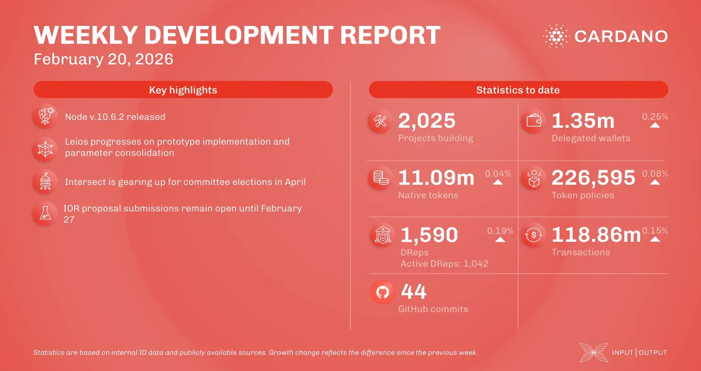

Node v.10.6.2 is live, featuring structural enhancements and preparing the network for the version 11 hard fork. The ledger team progressed with nested transactions and account address improvements, while Hydra v.1.3 focuses on production adoption. Coinbase now accepts ada as loan collateral, and the Leios prototype successfully minted endorser blocks under load. Finally, Messari released the Q4 2025 report alongside Intersect's committee election announcement.

 [**Read more**](https://www.essentialcardano.io/development-update/weekly-development-report-as-of-2026-02-20) 

 

