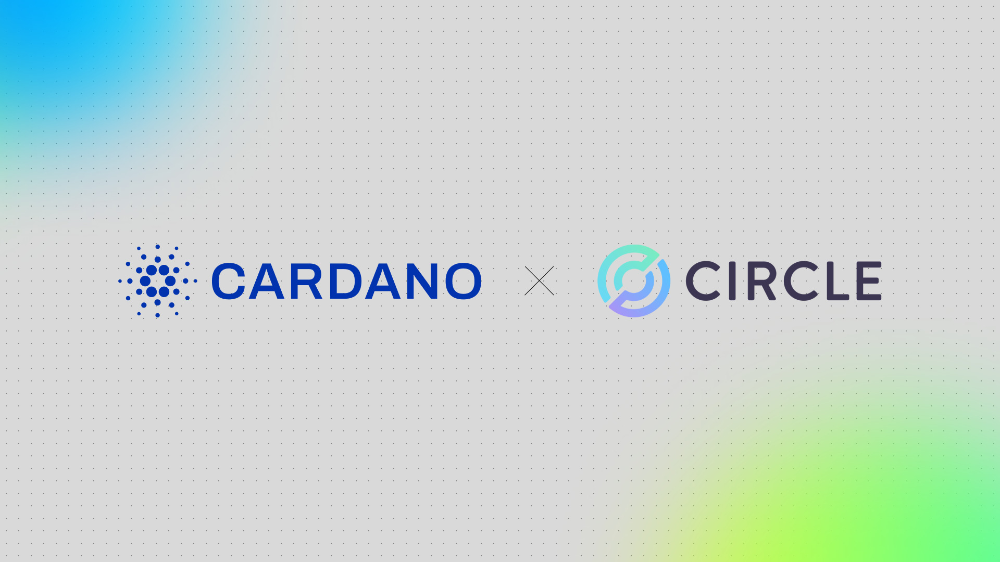

The February 27, 2026, article by Giorgio Zinetti announces the launch of USDCx on the Cardano mainnet, providing native liquidity backed 1:1 by USDC via Circle xReserve. This integration, delivered by the Pentad, eliminates third-party bridge risks and enables seamless cross-chain capital flows through Circle’s Cross-Chain Transfer Protocol. By strengthening the network's financial rails, USDCx enhances interoperability with other ecosystems and simplifies capital movement between Cardano and centralized exchanges.

 [**Read more**](https://cardanofoundation.org/blog/usdcx-live-cardano-mainnet) 

 

