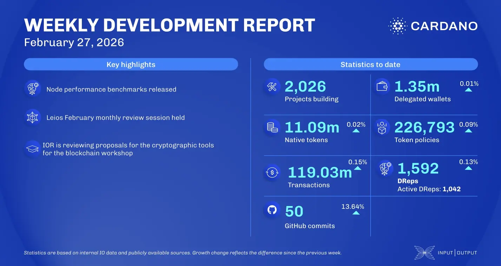

The February 27, 2026, development report highlights MoneyGram becoming a federated node operator for Midnight and the Cardano Foundation assuming stewardship of Project Catalyst. Yoroi introduced dual rewards for ada and night tokens. The core team released performance benchmarks for node v.10.5.4 and v.10.6.2. Mithril progressed with succinct SNARK proofs, while the Leios team presented a working prototype capable of producing endorser blocks under high load.

 [**Read more**](https://www.essentialcardano.io/development-update/weekly-development-report-as-of-2026-02-27) 

 

