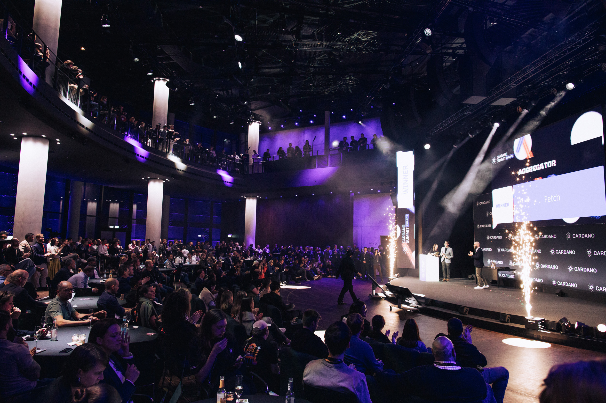

Cardano Summit 2025 surpassed major KPIs, hosting 1,460 in-person attendees in Berlin and 26,000 global online viewers. High-level engagement from enterprises like Volvo and Mastercard underscored the network's increasing institutional appeal. As the first flagship event funded entirely by the treasury, it showcased the ecosystem's decentralized maturity. With the 2025 journey concluded, preparations are already in motion for the 2026 Summit in Singapore.

 [**Read more**](https://cardanofoundation.org/blog/cardano-summit-2025-journey-and-results) 

 

