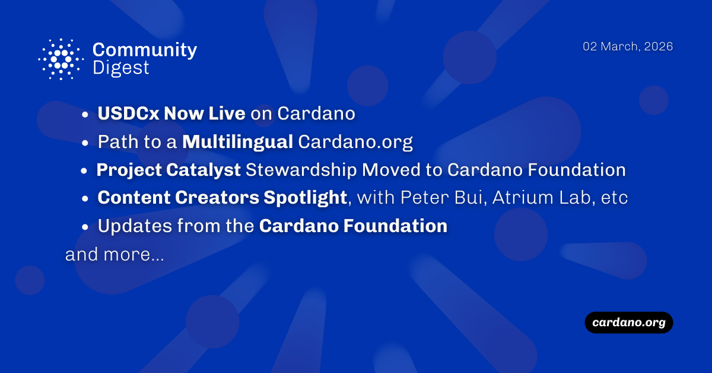

The March 03, 2026, Cardano Community Digest highlights the official mainnet launch of USDCx, providing native liquidity through Circle’s xReserve. The Cardano Foundation announced a transition to a multilingual cardano.org and assumed stewardship of Project Catalyst from IOG to ensure continuity. Technical updates include the release of Cardano-Signer 1.35.0, while the ecosystem welcomed a new ambassador, Bernard Sibanda, and celebrated diverse enterprise adoption cases like Petrobras and Plastiks.

 [**Read more**](https://forum.cardano.org/t/digest-march-03-2026-usdcx-now-live-on-cardano-path-to-a-multilingual-cardano-org-cardano-signer-1-35-0-released-project-catalyst-stewardship-transition-to-cf-content-creators-spotlight-peter-bui-learn-cardano-atrium-lab-and-more/153418) 

 

