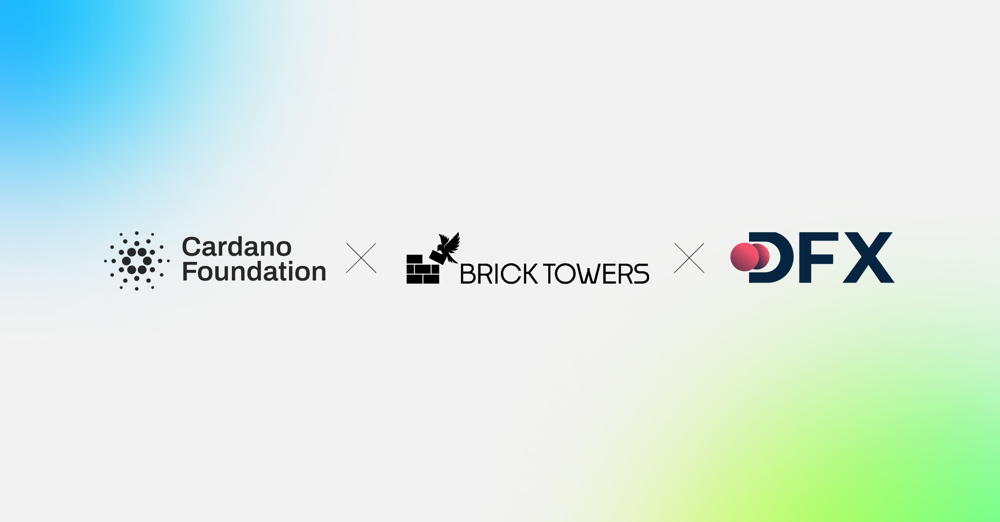

The March 05, 2026, press release by Siobhán Calpin announces that ada is now accepted at 137 SPAR stores across Switzerland. This integration, powered by DFX.swiss and the Open Crypto Pay standard, allows customers to pay directly from native wallets without centralized intermediaries. The partnership significantly reduces transaction costs for retailers while marking a major milestone in the real-world, everyday adoption of the Cardano network.

 [**Read more**](https://cardanofoundation.org/blog/ada-accepted-spar-switzerland) 

 

