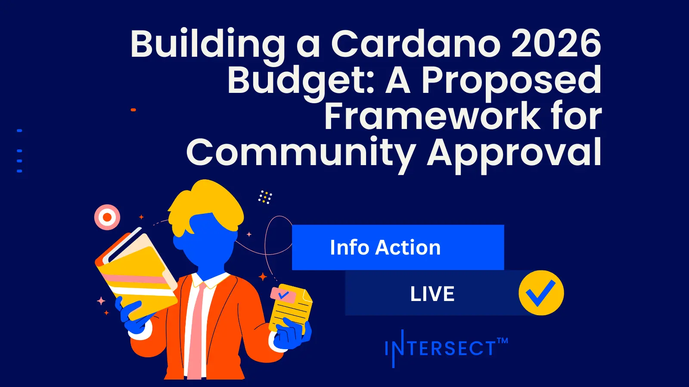

The March 05, 2026, Intersect report proposes a structured framework for coordinating the next budget cycle. This Info Action asks DReps to validate a process aligned with the Cardano Vision 2030 and measurable ecosystem KPIs. Key features include a minimum proposal size of 100,000 ada and standardized templates to improve transparency. The framework aims to ensure treasury resources are deployed responsibly while maintaining long-term economic sustainability for the network.

 [**Read more**](https://www.intersectmbo.org/news/building-a-2026-ecosystem-budget-for-cardano) 

 

