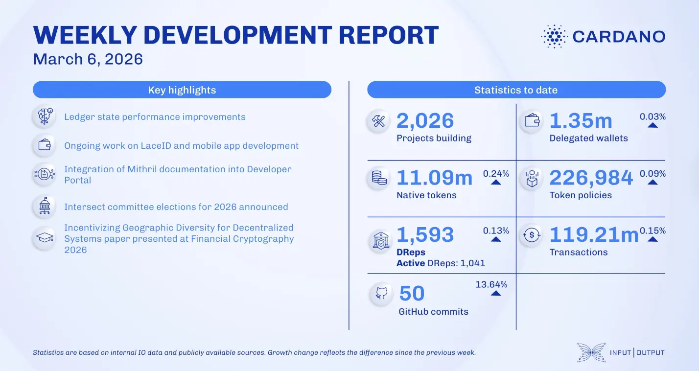

The March 06, 2026, development report highlights that 137 SPAR stores in Switzerland now accept ada for payments. The ledger team progressed with nested transactions and performance restructuring. Lace wallet supported the Midnight mainnet release and advanced the LaceID identity feature, while the Mithril team completed signer authentication for SNARK verification keys. Research breakthroughs included formal models for geographic diversity and Sybil-proofness in restaking.

 [**Read more**](https://www.essentialcardano.io/development-update/weekly-development-report-as-of-2026-03-06) 

 

