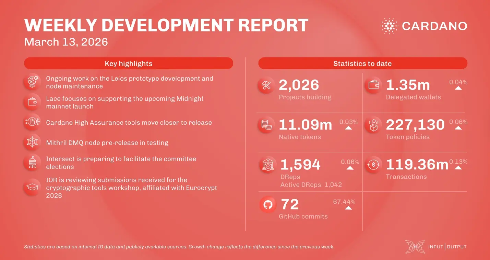

Binance listed the NIGHT token, and the Sandstone team released Torsten, a new Cardano node written in Rust. The consensus team progressed on the Ouroboros Leios prototype and updated the node-to-client protocol to version 23. Lace is preparing for the Midnight mainnet launch, while Mithril continues implementing succinct proofs (SNARKs). Additionally, Intersect announced that committee election applications will open on March 30.

 [**Read more**](https://www.essentialcardano.io/development-update/weekly-development-report-as-of-2026-03-13) 

 

