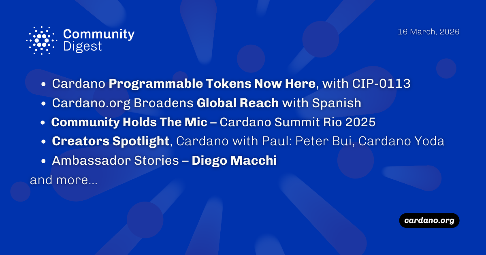

Programmable Tokens and the CIP-0113 standard are live, allowing customizable on-chain rules for native assets. Cardano.org has added Spanish support, and the Summit Rio 2025 highlighted the value of IRL collaboration. FluidTokens introduced gold-backed lending, while the new SuperNode tool simplifies deployment for SPOs and partner chains.

 [**Read more**](https://forum.cardano.org/t/digest-march-16-2026-cardano-programmable-tokens-with-cip-0113-cardano-org-expands-with-spanish-community-holds-mic-summit-rio-2025-creator-spotlight-cardano-with-paul-cardanoyoda-ambassador-stories-diego-macchi/153632) 

 

