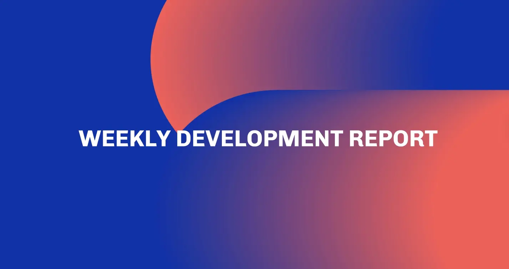

The ledger team reached a major milestone by releasing all packages for cardano-node v.10.7, preparing for the intra-era hard fork to protocol version 11. Mithril advanced its SNARK circuit refactoring and published a blog on mainnet protocol changes. Meanwhile, Hydra version 1.3.0 was released, featuring progress on partial fanouts and fixes for high transaction loads. The team is now focusing on the upcoming Dijkstra era.

 [**Read more**](https://www.essentialcardano.io/development-update/weekly-development-report-as-of-2026-03-20) 

 

