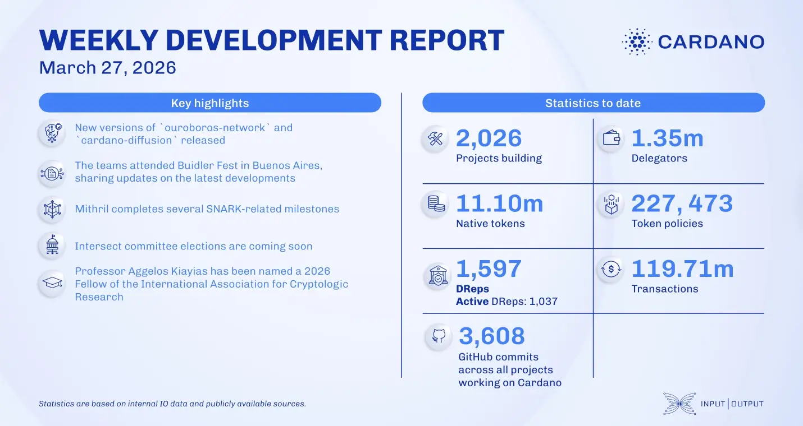

The networking and consensus teams supported the node v.10.7.0 release and progressed on the Peras protocol, including on-chain certificate tracking. Mithril completed the Halo2 circuit and SNARK aggregation primitives, while Hydra advanced the partial fanout and directly open heads features. Additionally, Professor Aggelos Kiayias was named a 2026 IACR Fellow for his cryptographic contributions.

 [**Read more**](https://www.essentialcardano.io/development-update/weekly-development-report-as-of-2026-03-27) 

 

