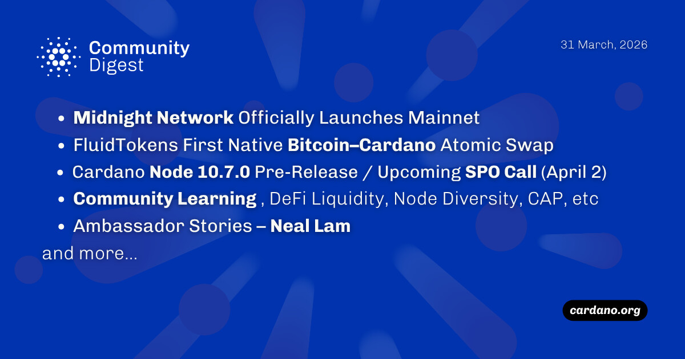

The Midnight network has officially launched its mainnet, enabling privacy-preserving applications via zero-knowledge proofs. FluidTokens executed the first native Bitcoin–Cardano atomic swap, allowing trustless trading without bridges. Cardano Node v.10.7.0 was pre-released, introducing the LSM Tree to reduce RAM usage from 24GB to 8GB. Stake Pool Operators are invited to an SPO Call on April 2 to discuss these updates and the path toward the Van Rossum hard fork.

 [**Read more**](https://forum.cardano.org/t/digest-march-31-2026-midnight-network-launches-mainnet-fluidtokens-first-native-bitcoin-cardano-atomic-swap-cardano-node-10-7-0-pre-release-spo-call-april-2-defi-liquidity-node-diversity-cap-etc-ambassador-stories-neal-lam/153858) 

 

