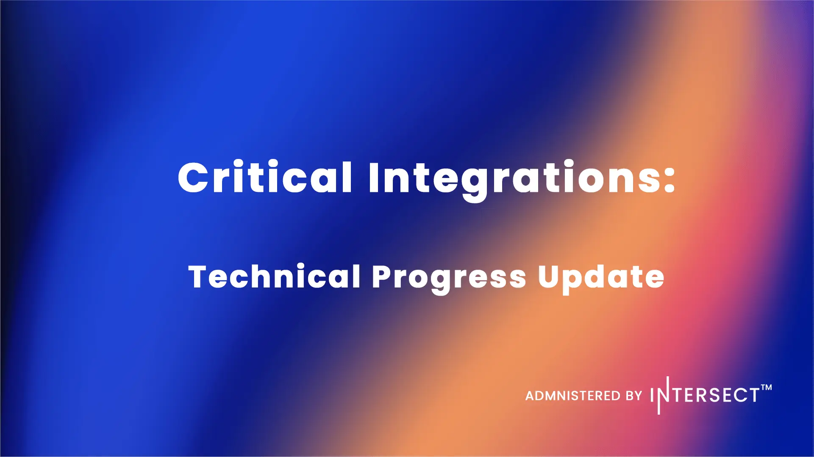

The Pentad has transitioned to delivering Critical Integrations, headlined by the live launch of USDCx, which boosted Cardano's stablecoin supply by 40%. Pyth Network oracles are now code-complete for a Q2 launch, while Dune Analytics and LayerZero integrations are currently in progress. Furthermore, the design phase for Pentad V2 has begun, focusing on expanding infrastructure and capital flow.

 [**Read more**](https://www.intersectmbo.org/news/critical-integrations-technical-progress-update-and-pentad-v2) 

 

