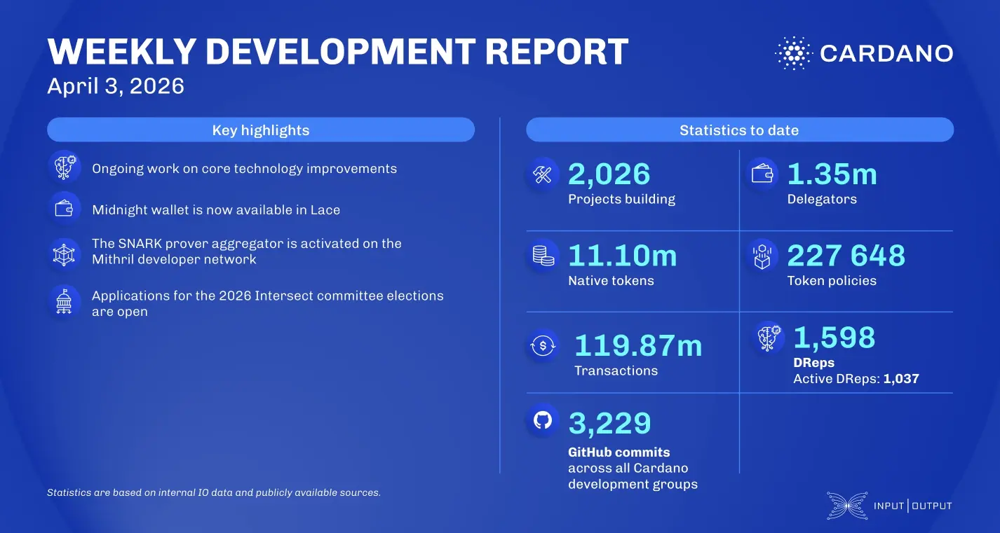

The performance and benchmarking team ran benchmarks on node v.10.6.2 and began developing tx-centrifuge, a service for generating high network workloads. Lace reached a major milestone by integrating Midnight mainnet access, allowing users to manage private assets directly in the wallet. Mithril successfully activated the SNARK prover on a developer network, while Intersect opened applications for the 2026 committee elections, with seats available across seven standing committees until April 17.

 [**Read more**](https://www.essentialcardano.io/development-update/weekly-development-report-s-of-2026-03-03) 

 

