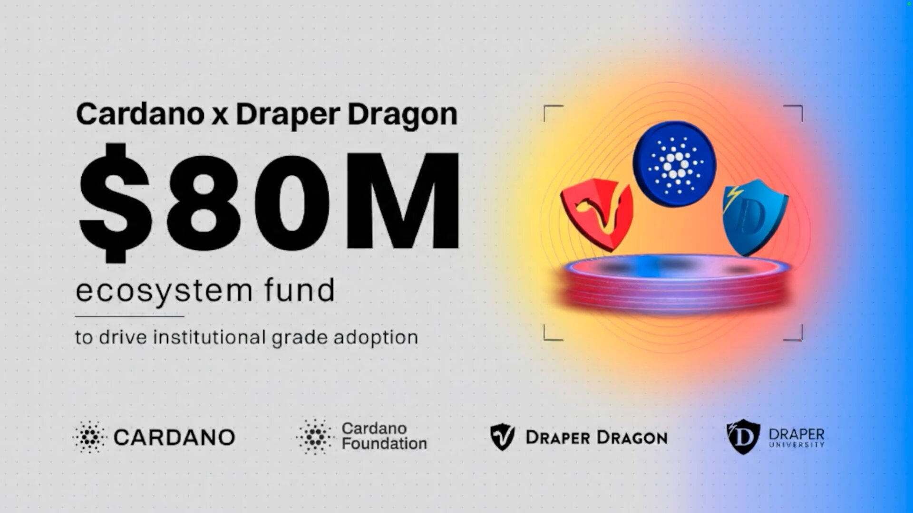

The Cardano Foundation and Draper Dragon launched the $80M Orion Fund to drive institutional adoption through Real-World Assets (RWA), DeFi, and bridging Bitcoin liquidity to Cardano. Supported by Draper University, the fund uses an equity-first approach to return value to the Cardano treasury via a specialized vehicle (Arouet Holdings).

 [**Read more**](https://cardanofoundation.org/blog/orion-fund-initial-phase) 

 

