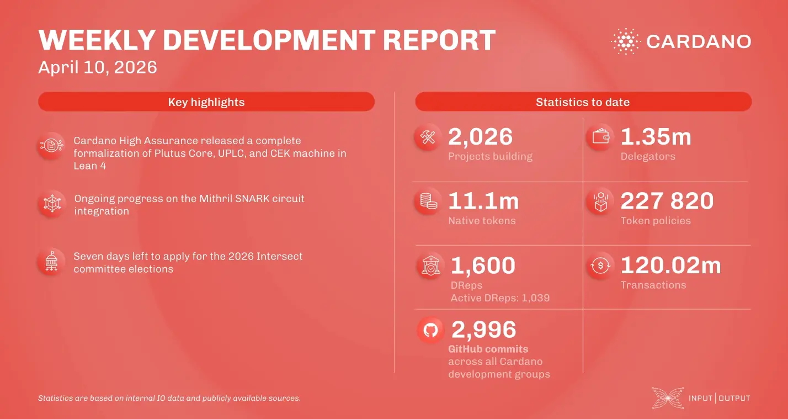

The High Assurance team released PlutusCoreBlaster, a full formalization of Plutus Core in Lean 4 for enhanced smart contract verification. The Plutus team improved compiler usability and added UPLC optimizations to increase execution efficiency. Mithril completed the review of its recursive SNARK circuit prototype and finalized the client CLI for Cardano blocks. Lastly, Intersect noted only seven days remain for 2026 committee election applications, closing April 17.

 [**Read more**](https://www.essentialcardano.io/development-update/weekly-development-report-as-of-2026-04-10) 

 

