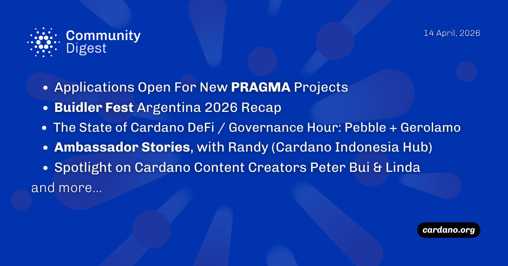

Pragma is now accepting applications for open-source infrastructure projects following Buidler Fest 2026 in Buenos Aires. New highlights include the Gerolamo TypeScript node, a Cardano ETF (CRDD) from Volatility Shares, and the network surpassing 120 million transactions. Despite a minor node regression fix, the Van Rossem hard fork remains on track for late June.

 [**Read more**](https://forum.cardano.org/t/digest-april-14-2026-applications-open-for-new-pragma-projects-buidler-fest-2026-recap-the-state-of-cardano-defi-governance-hour-pebble-gerolamo-ambassador-stories-with-randy-content-creators-peter-bui-linda/154095) 

 

