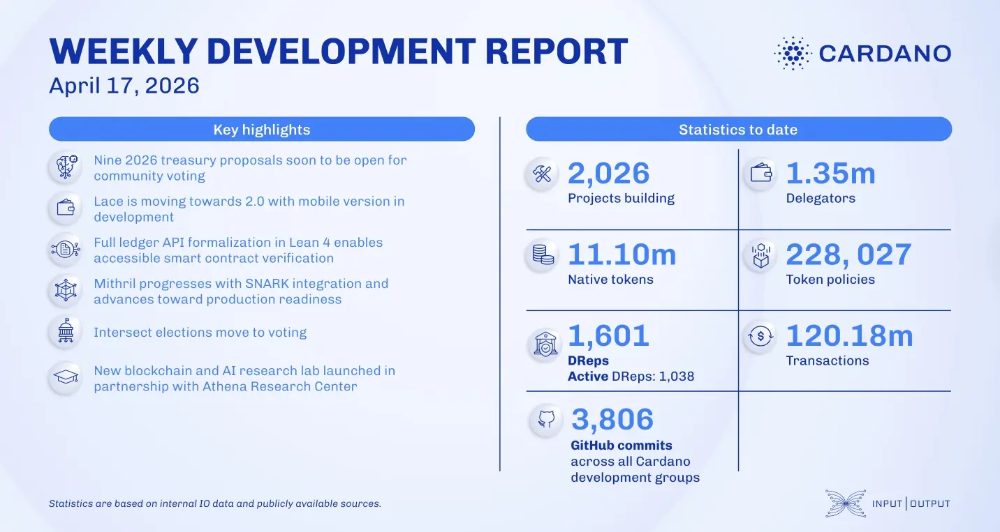

Nine 2026 treasury proposals have been finalized, outlining the roadmap for Cardano’s core protocol and scaling initiatives. Technical teams successfully integrated Leios endorser blocks and optimized Node v10.7 for the upcoming Van Rossem hard fork. Innovation continues with a new decentralized AI and healthcare lab in Greece, while the Intersect committee elections move into the voting phase on April 20.

 [**Read more**](https://www.essentialcardano.io/development-update/weekly-development-report-as-of-2026-04-17) 

 

