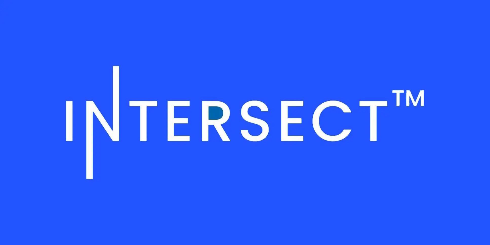

Intersect is shifting to a flexible 2026 strategy focused on five pillars, including infrastructure stewardship. Key to this is a new 3% administration fee, replacing flat budgets to provide on-demand support for treasury projects. They also launched the Administration Hub for transparency and are preparing for a multi-client future to boost network resilience.

 [**Read more**](https://www.intersectmbo.org/news/intersect-in-2026-renewed-focus-stronger-foundations) 

 

