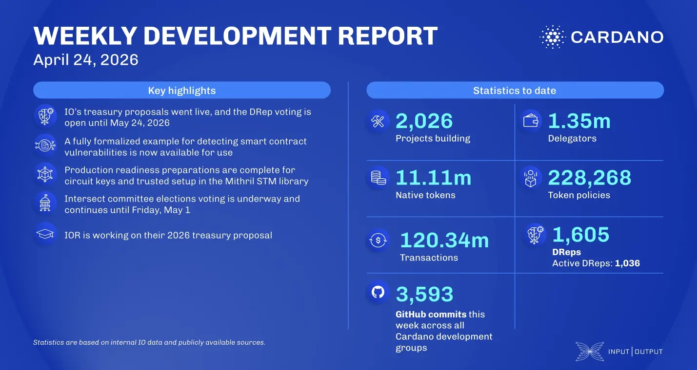

Nine 2026 treasury proposals from IO are now live, focusing on scalability and performance with DRep voting open until May 24. The consensus team advanced the Leios prototype by adding throughput metrics and investigating storage latency to ensure protocol stability. A significant update from the Plutus team introduced script optimizations for the UPLC executable, which can reduce execution costs by an average of 10%. Additionally, the Mithril team prepared for SNARK circuit production readiness, while Intersect committee elections are underway with 105 candidates competing for 37 seats.

 [**Read more**](https://www.essentialcardano.io/development-update/weekly-development-report-as-of-2026-04-24) 

 

