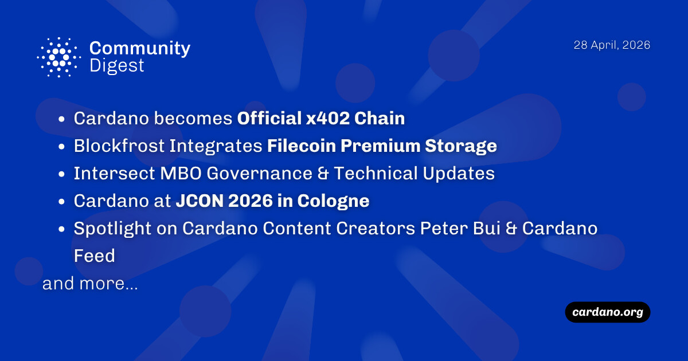

Cardano has officially integrated the x402 standard, enabling automated payments for AI agents, while Blockfrost introduced decentralized data backups through Filecoin. Technical milestones include the nearing mainnet-readiness of the Van Rossem Upgrade (Node v11.0) and the release of the 2026-27 Budget Proposal. The introduction of the JuLC compiler at JCON now allows Java developers to build smart contracts, alongside a major 21M ADA marketing proposal aimed at scaling enterprise adoption.

 [**Read more**](https://forum.cardano.org/t/digest-april-28-2026-cardano-becomes-official-x402-chain-blockfrost-integrates-filecoin-premium-storage-intersect-mbo-governance-technical-updates-cardano-at-jcon-2026-in-cologne-spotlight-on-cardano-content-creators/154318) 

 

