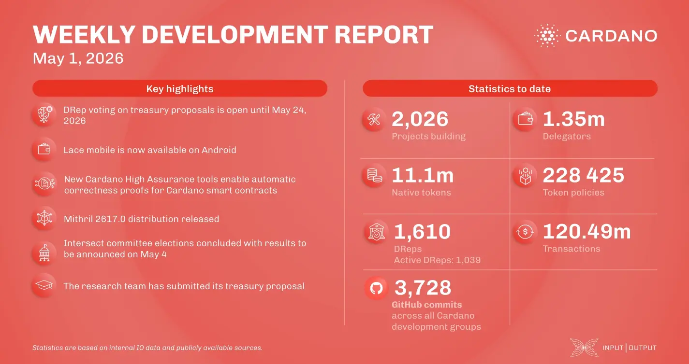

This report marks the launch of IO’s 2026 treasury proposals on the official proposals website, accompanied by the Q4 2025 – Q1 2026 delivery report detailing recent technical milestones. The consensus team continues to advance the Ouroboros Leios prototype, while the Mithril team focuses on implementing succinct proofs (SNARKs) to enhance network scaling. In governance, the Intersect committee elections conclude their voting phase today, May 1, marking a key step in decentralized decision-making for the ecosystem.

 [**Read more**](https://www.essentialcardano.io/development-update/weekly-development-report-as-of-2026-05-01) 

 

