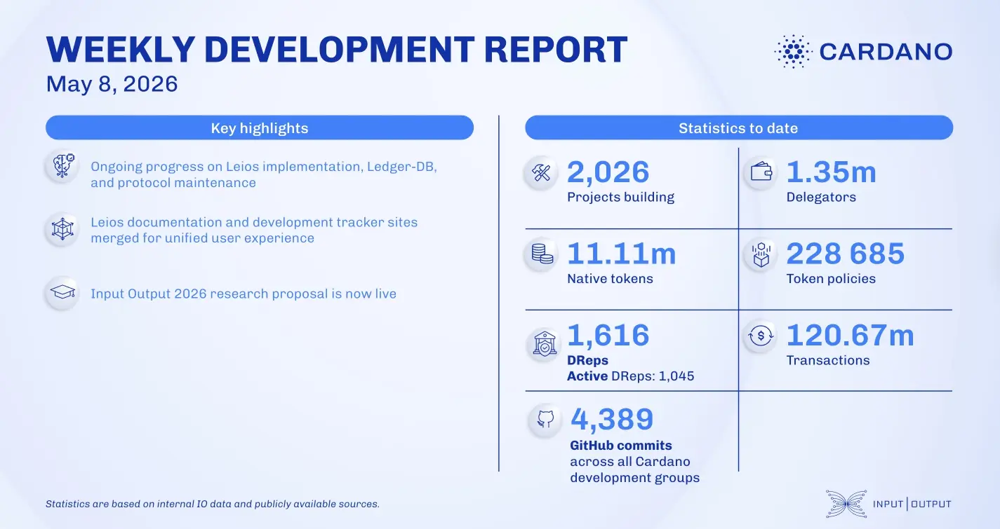

The consensus team advanced the Leios prototype by migrating flags to the Praos header, launching a dedicated testnet, and pre-releasing Cardano Node v11.0. In scaling, Hydra optimized benchmark performance for high transaction volumes, while Mithril completed data encoding and state transition tests for its recursive SNARK prototype. Additionally, the research team officially submitted their proposal on-chain.

 [**Read more**](https://www.essentialcardano.io/development-update/weekly-development-report-as-of-2026-05-08) 

 

