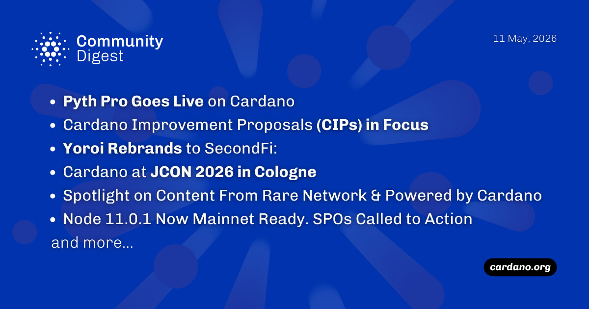

Pyth Pro is live on Cardano, delivering low-latency institutional price feeds to DeFi via Indigo Protocol. Separately, EMURGO announced Yoroi Wallet's rebrand to SecondFi, evolving it into a broader neofinance platform. Intersect confirmed its committee election results and verified Node v11.0.1 is mainnet-ready for the Van Rossem hard fork. Additionally, the Cardano Foundation partnered with the University of Brasília for a new tech lab and integrated with Scorechain for compliance.

 [**Read more**](https://forum.cardano.org/t/digest-may-11-2026-pyth-pro-goes-live-on-cardano-cardano-improvement-proposals-cips-in-focus-yoroi-rebrands-to-secondfi-cardano-at-jcon-2026-in-cologne-spotlight-on-content-from-rare-network-powered-by-cardano/154528) 

 

