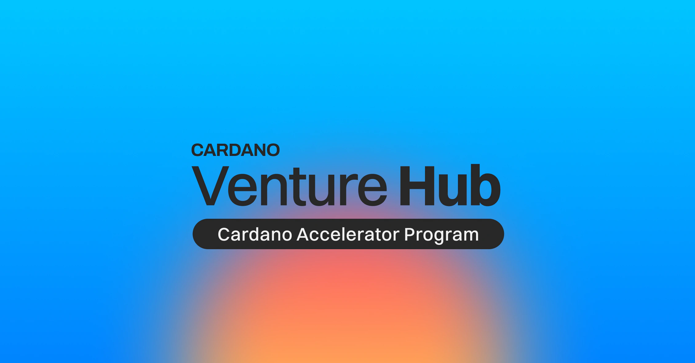

The Cardano Accelerator Program (CAP) is accepting applications for its Fall 2026 cohort, themed Real-World Trust. Run by the Cardano Foundation, the program accelerates early-stage startups building data verification infrastructure like identity, traceability, and digital passports. Participants receive technical and business mentoring leading up to an investor Demo Day. Eligible startups must be registered entities with a live transactional product.

 [**Read more**](https://cardanofoundation.org/blog/cardano-foundation-university-brasilia-partnership) 

 

