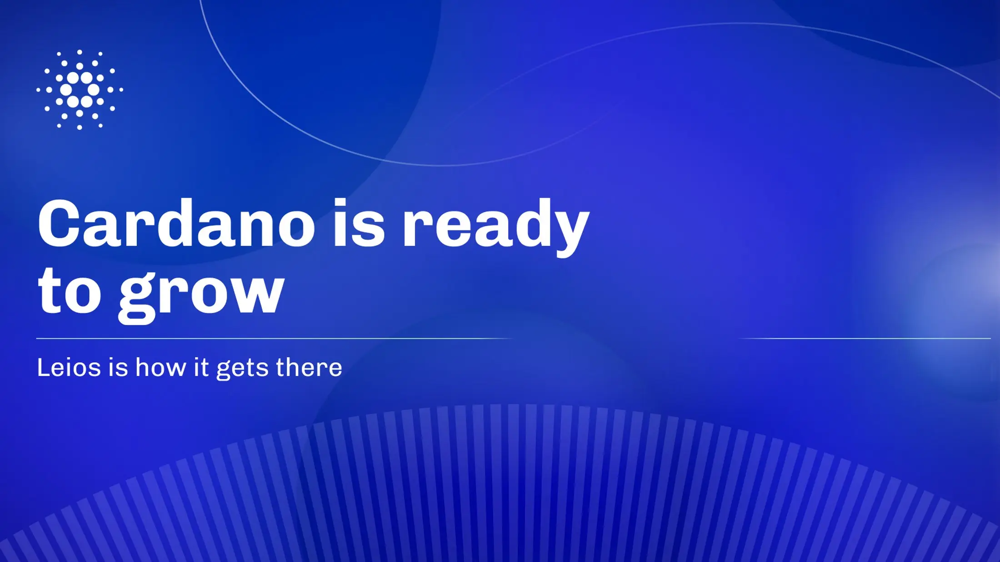

IOG has submitted a treasury proposal for ₳27.7M to mature Ouroboros Leios from a testnet prototype into a mainnet-ready release candidate by late 2026. By introducing endorser blocks and committee-based validation, Leios will safely scale Cardano’s throughput capacity by 10x to 65x through a phased rollout. This development directly supports the ecosystem's Vision 2030 goals, featuring milestone-gated funding and independent oversight.

 [**Read more**](https://www.iog.io/news/cardano-is-ready-to-grow) 

 

