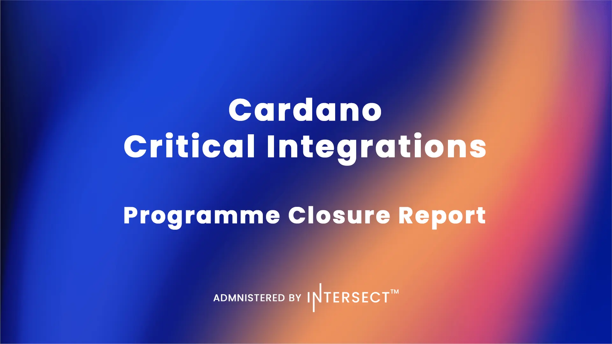

The CCI V1 closure report accounts for the ₳70M treasury budget managed by Intersect to onboard tier-one Cardano infrastructure. It successfully deployed native Circle USDC, LayerZero, Pyth Network, and Dune Analytics. Institutional custody via Fireblocks missed the V1 window due to unmet commercial terms and will instead be requested alongside Year 2 maintenance in the upcoming CCI V2 proposal.

 [**Read more**](https://www.intersectmbo.org/news/cardano-critical-integrations-programme-closure-report) 

 

