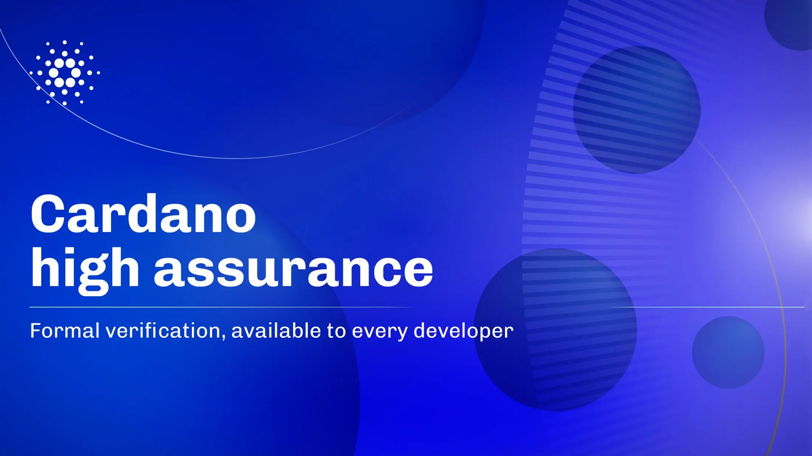

IOG has introduced Blaster, an automated formal verification engine for Lean 4 designed to provide mathematical security guarantees for Cardano smart contracts. Tested on complex protocols like Djed and USDCx, Blaster automatically checks for common vulnerabilities (such as double satisfaction) using a Common Vulnerability Library. Developed alongside six ecosystem partners, this tool aims to lower the barrier to high-assurance development, fostering institutional trust and TVL growth for Cardano's Vision 2030.

 [**Read more**](https://www.iog.io/news/cardano-high-assurance-formal-verification) 

 

