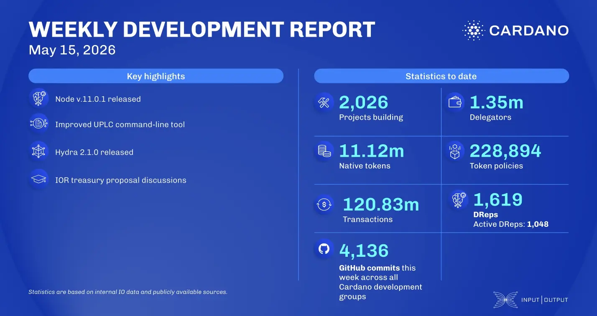

IO's core teams released Cardano Node v11.0.1 to support the upcoming protocol version 11 intra-era hard fork, while the ledger team advanced preparations for the Dijkstra era. The Plutus team enhanced the UPLC command-line tool, introducing script optimizations that yield over 10% in execution cost savings. In scaling, Hydra v2.1.0 was launched with 7% lower snapshot latency and protocol v12+ compatibility, and Mithril finalized key SNARK circuit validations and standard Schnorr signatures.

 [**Read more**](https://www.essentialcardano.io/development-update/weekly-development-report-as-of-2026-05-15) 

 

