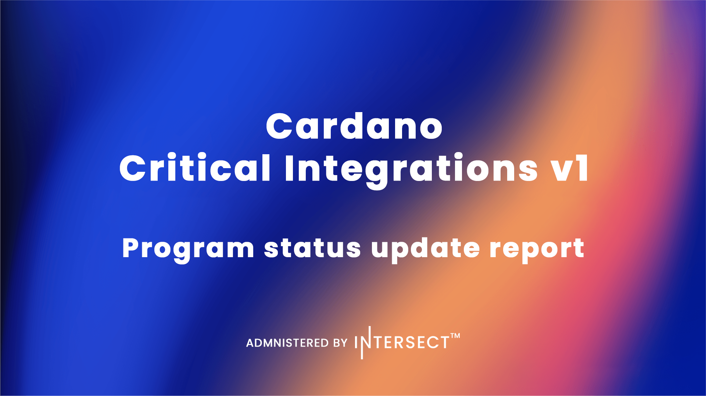

Three of the five priority integrations funded by the ₳70,000,000 Cardano Critical Integrations budget (CCI V1) are now live: Circle's native USDC issuance on Cardano, Pyth Network pricing oracles, and Dune Analytics coverage. LayerZero cross chain messaging and bridge infrastructure remains in active delivery, while institutional custody via Fireblocks continues under negotiation. A separate treasury withdrawal, CCI V2, will be brought forward to fund Year 2 contracted costs and a 12 month maintenance and enhancement program for the integrations delivered under V1.

 [**Read more**](https://www.intersectmbo.org/news/cardano-critical-integrations-program-status-update-report) 

 
