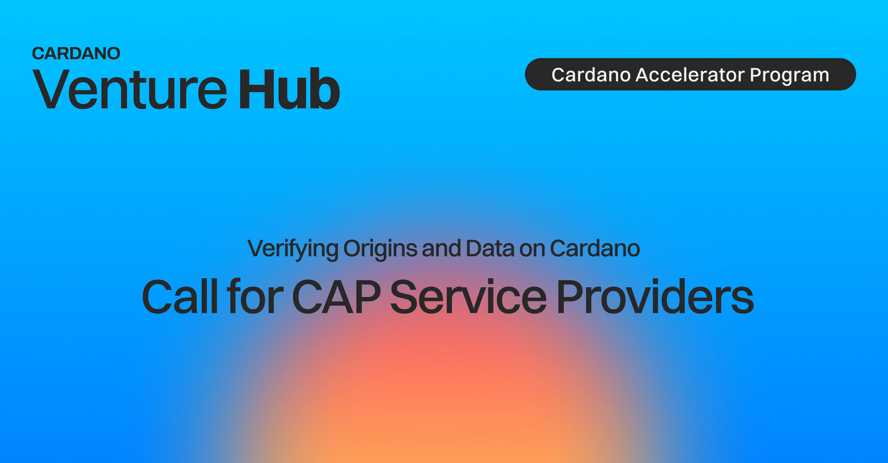

The Cardano Accelerator Program (CAP) is seeking specialized service providers for its Fall 2026 cohort, themed around Real-World Trust. Registered legal entities with a proven track record in areas such as go-to-market strategy, compliance, and fundraising can apply to deliver expert-led workshops for the participating startups. The application deadline is June 5, 2026.

 [**Read more**](https://cardanofoundation.org/blog/cap-service-providers-fall26) 

 

