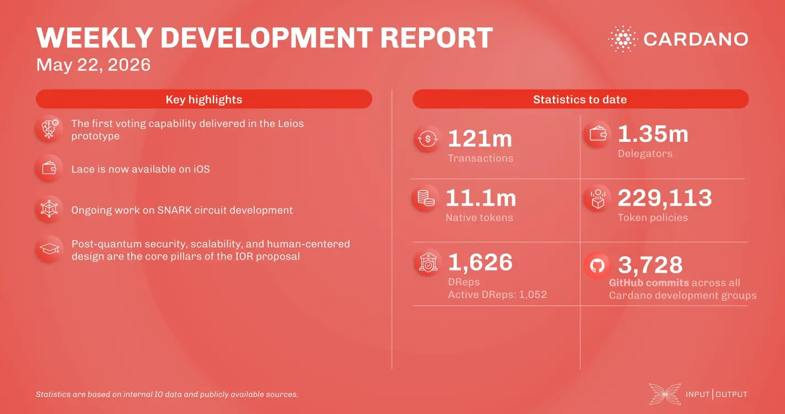

The consensus team added initial voting capabilities to the Leios prototype and retired the legacy V1 LedgerDB to simplify the API and clear the way for on-disk tables. In wallets, Lace launched on iOS, wrapping up its multi-platform rollout. Additionally, the Mithril team finalized recursive circuit refactoring and off-circuit verification tests for its SNARK prototype.

 [**Read more**](https://www.essentialcardano.io/development-update/weekly-development-report-as-of-2026-05-22) 

 

