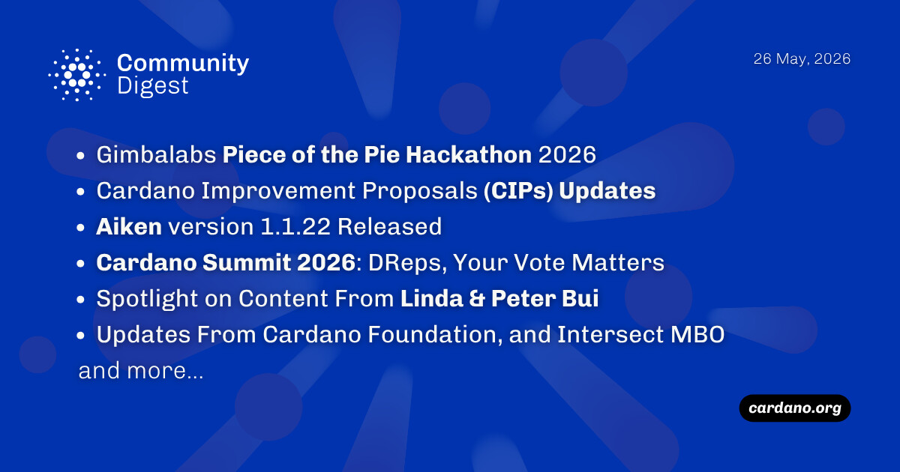

The Gimbalabs Piece of Pie Hackathon 2026 is underway, utilizing a "build in public" format with qualification based on weekly public updates. Three new CIP updates entered the pipeline, introducing mobile wallet deep-link signing and transaction prioritization, while Aiken v1.1.22 launched with compiler optimizations. Lastly, DReps are voting on a revised Cardano Summit 2026 proposal featuring a 22% budget cut, and the Foundation highlighted stablecoin insights from Mastercard.

 [**Read more**](https://forum.cardano.org/t/digest-may-26-2026-gimbalabs-piece-of-the-pie-hackathon-2026-cardano-improvement-proposals-cips-updates-aiken-version-1-1-22-released-cardano-summit-2026-dreps-your-vote-matters/154752) 

 

