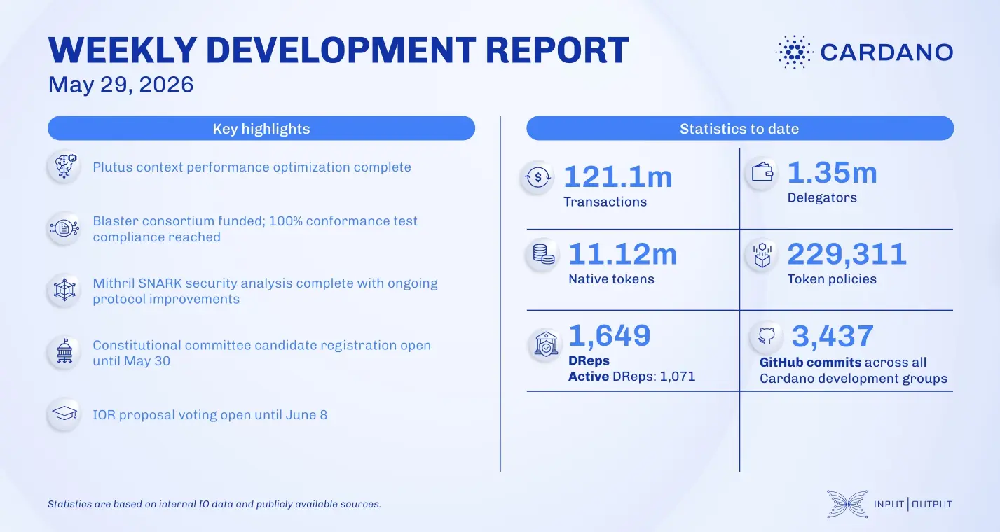

The ledger team completed Plutus performance optimizations, while the Smart Contracts team secured funding to extend the "Blaster" verification tool into Aiken. For Leios, treasury funding was approved with 88% support, and a CIP-0164 update reduced certificate size by 40x. Additionally, candidate registration opened for the Constitutional Committee elections.

 [**Read more**](https://www.essentialcardano.io/development-update/weekly-development-report-as-of-2026-05-29) 

 

