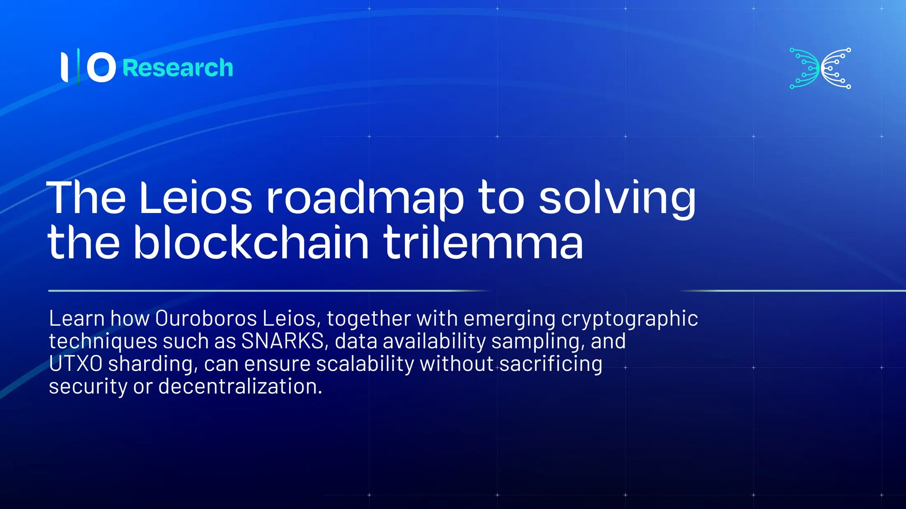

The Ouroboros Leios architecture solves the blockchain trilemma by decoupling transaction diffusion from sequencing. This setup integrates advanced cryptography, including SNARKs for sublinear correctness verification, Data Availability Sampling (DAS) to verify blocks without full downloads, and Bloom filters to check data relevance. Finally, UTXO sharding distributes state maintenance across the network, enabling true horizontal scalability so that consumer-grade hardware nodes can participate securely without processing the entire blockchain.

 [**Read more**](https://www.iog.io/news/the-leios-roadmap-to-solving-the-blockchain-trilemma) 

 

