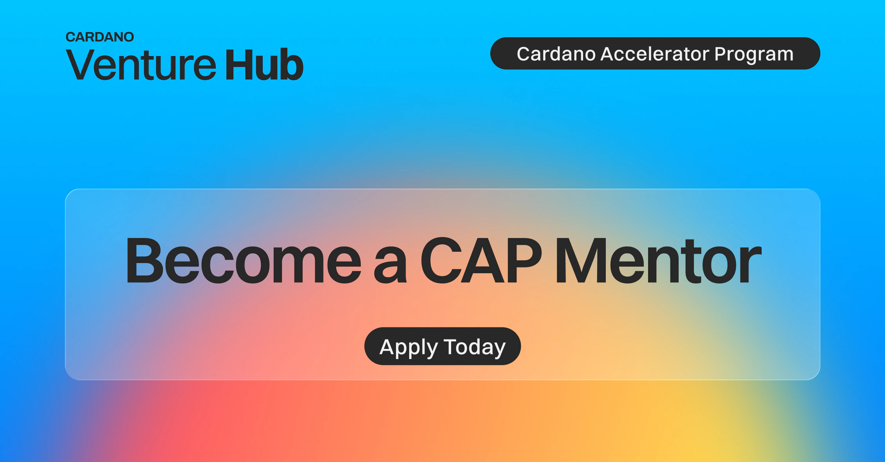

The Cardano Accelerator Program (CAP) is inviting subject matter experts to join its mentor network for the Fall 2026 cohort, themed Real-World Trust. Mentors will provide flexible, one-on-one guidance to startups focused on identity, traceability, and digital passports. This non-commercial engagement offers industry experts ecosystem-wide visibility in exchange for mentoring in strategy, compliance, or fundraising. Applications opened on June 5, 2026, for a one-month window.

 [**Read more**](https://cardanofoundation.org/blog/cap-fall26-call-for-mentors) 

 

