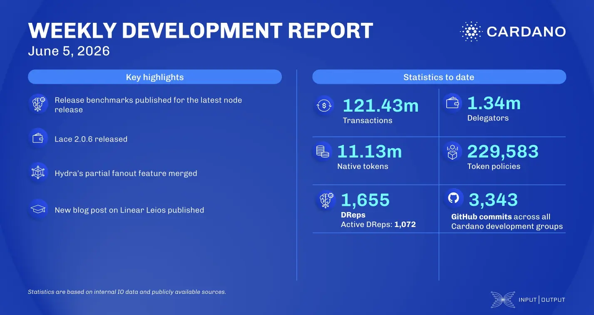

The consensus team advanced the Leios prototype toward the Dijkstra era and finalized the certificate size reduction to 200 bytes. In wallets, Lace 2.0.6 went live, fixing DRep ID message signing for mnemonic wallets and adopting the CIP-129 format. For scaling, Hydra merged its partial fanout feature to eliminate the UTXO limit per head, while Mithril completed circuit key caching for its SNARK library.

 [**Read more**](https://www.essentialcardano.io/development-update/weekly-development-report-as-of-2026-06-05) 

 

