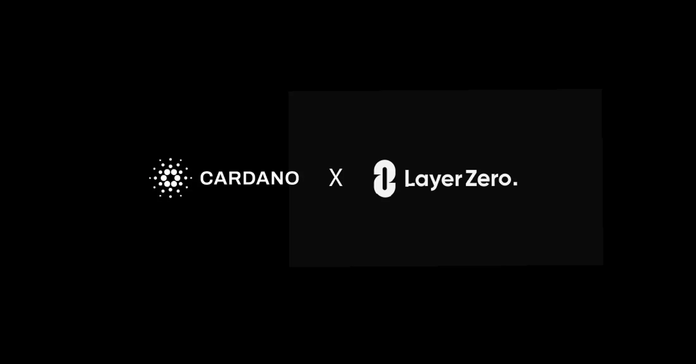

The LayerZero integration connects Cardano to the wider crypto economy, enabling over 800 tokens to move natively onto the network. These assets will benefit from Cardano's built-in ledger security and deterministic smart contracts. The rollout will proceed in phases through 2026 launching endpoints, the Stargate liquidity layer, and developer tools with the goal of supporting any asset by year-end.

 [**Read more**](https://www.iog.io/news/cardano-is-connecting-to-all-of-crypto) 

 

