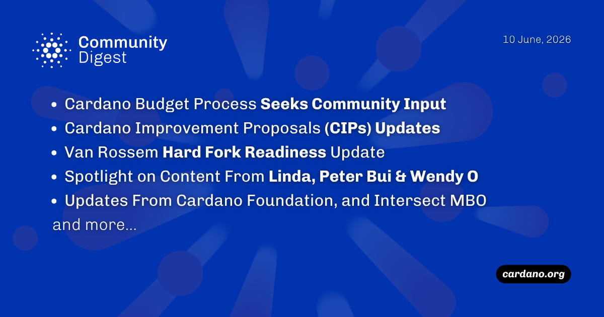

The Cardano Budget Process has commenced voting on the Hydra platform to fund core usability and security infrastructure. Meanwhile, the Van Rossem hard fork (Protocol Version 11) successfully launched on the PreProd testnet, marking the final checkpoint before mainnet deployment. New CIP updates introduced variable deposits for stake pool pledges and Hydra-powered L2 voting, while the Cardano Foundation announced a three-year partnership with the Brazilian Olympic Committee and published an agricultural tracking case study in India.

 [**Read more**](https://forum.cardano.org/t/digest-june-10-2026-cardano-budget-process-seeks-community-van-rossem-hard-fork-readiness-update-spotlight-on-content-from-linda-peter-bui-wendy-o/155025) 

 

