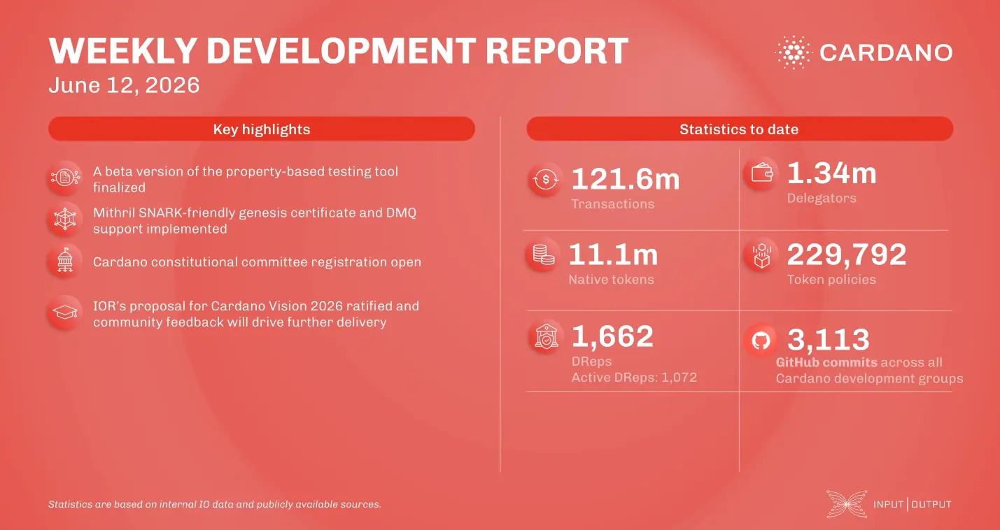

The High Assurance team launched a smart contract testing beta tool, while the Mithril team completed its SNARK-friendly genesis certificate and optimized recursive scaling primitives. Under Voltaire, a critical call for candidates was issued for the upcoming Constitutional Committee election to ensure a competitive process. Finally, the Research team had its Cardano Vision 2026 proposal officially ratified by the community with 74.96% DRep approval.

 [**Read more**](https://www.essentialcardano.io/development-update/weekly-development-report-as-of-2026-06-12) 

  

