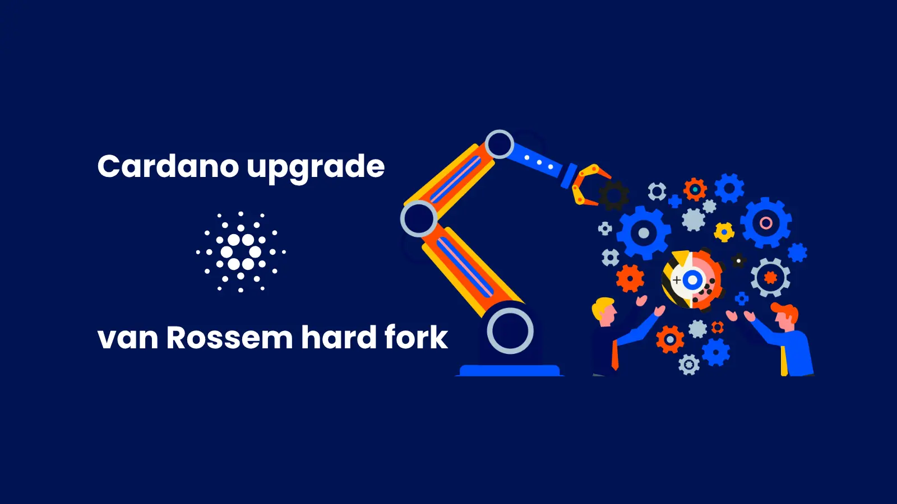

The van Rossem hard fork upgrade for the Cardano Mainnet has officially commenced. The process coordinates two distinct governance actions: a Plutus Cost Model parameter update (enacted on June 18) and the hard fork initiation action (submitted on June 16). Following successful testing on the Preview and Preprod testnets, the final decision to ratify and execute the upgrade now rests entirely with the on-chain governance bodies (DReps, SPOs, and the Constitutional Committee).

 [**Read more**](https://www.intersectmbo.org/news/cardano-upgrade-van-rossem-hard-fork) 

 

