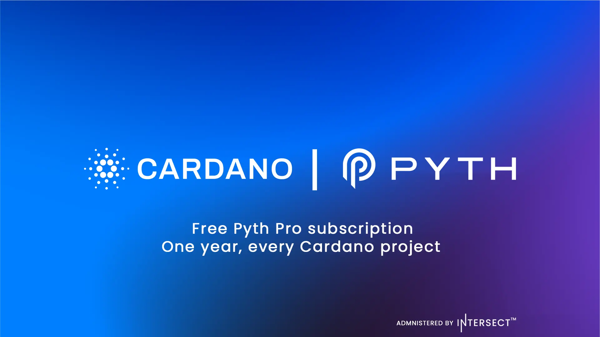

The Pyth Network has launched on Cardano, offering all ecosystem projects one year of free, unlimited access to a Pyth Pro API key. Facilitated by the "Pentad" under the critical integrations budget, this integration provides builders with institutional-grade, real-time market data. Structurally, it utilizes a pull oracle model where off-chain data is requested on-demand and verified cryptographically on-chain, keeping transaction fees minimal for decentralized applications.

 [**Read more**](https://www.intersectmbo.org/news/pyth-pro-on-cardano-subscription-offer) 

 

