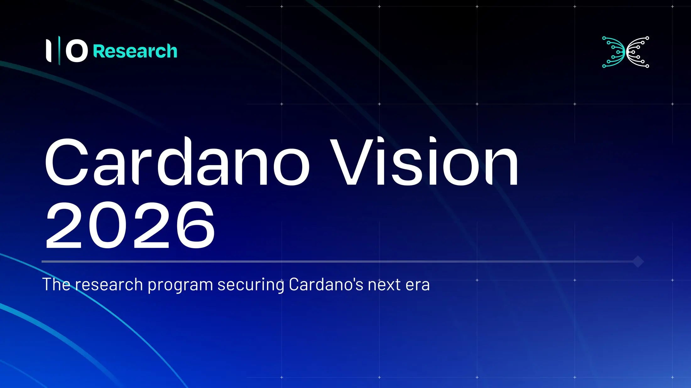

The Cardano Vision 2026 research roadmap outlines 15 key initiatives across six core technical pillars. Developed by a global academic consortium, the program drives multi-layer scalability (via Leios and Peras), cross-chain zero-knowledge (ZK) tooling, decentralized identity, and verified governance models. Its primary strategic defense is a bottom-up post-quantum cryptography (PQC) framework designed to preemptively swap out core consensus primitives for quantum-secure alternatives.

 [**Read more**](https://www.iog.io/news/cardano-vision-2026-the-research-program-securing-cardano) 

 

