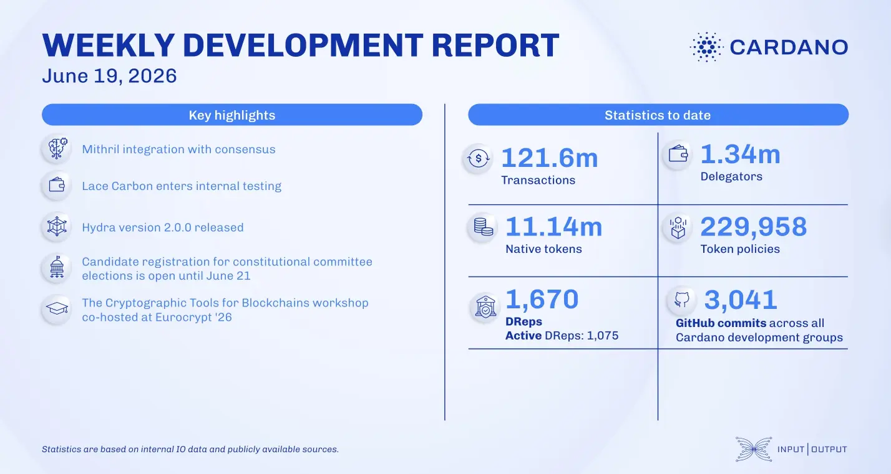

The Consensus team improved Mithril integration for snapshot exports, while Lace Carbon began internal testing. For scaling, Hydra v2.2.0 launched with upgraded benchmarks, and Mithril finalized recursive SNARK verification. Under Voltaire, the Constitutional Committee election became competitive with five candidates for four seats, with DRep voting starting June 23. The Research team advanced its Cardano Vision 2026 workstreams.

 [**Read more**](https://www.essentialcardano.io/development-update/weekly-development-report-as-of-2026-06-19) 

  

