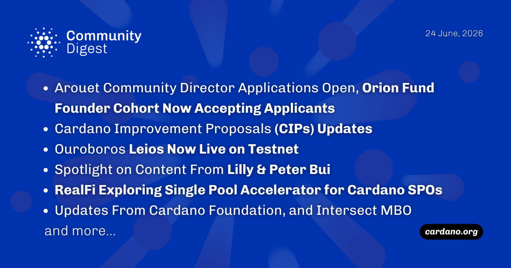

The latest ecosystem updates highlight the launch of the Ouroboros Leios testnet (Musashi Dojo), introducing parallel "endorser blocks" to potentially scale network throughput from 4.5 KB/s up to 200 KB/s. Additionally, applications open next week for the $80M Draper Dragon Orion Fund startup cohort and a voluntary Community Director seat on the Arouet Holdings board. Other major highlights include Pyth Network oracles going live on Cardano and the Cardano Foundation's inclusion in Fortune's Crypto Innovators 2026 list.

 [**Read more**](https://forum.cardano.org/t/digest-june-24-2026-arouet-community-director-applications-open-next-week-orion-fund-founder-cohort-now-accepting-applicants-ouroboros-leios-now-live-on-testnet-updates-from-cardano-foundation-and-intersect-mbo/155248) 

 

