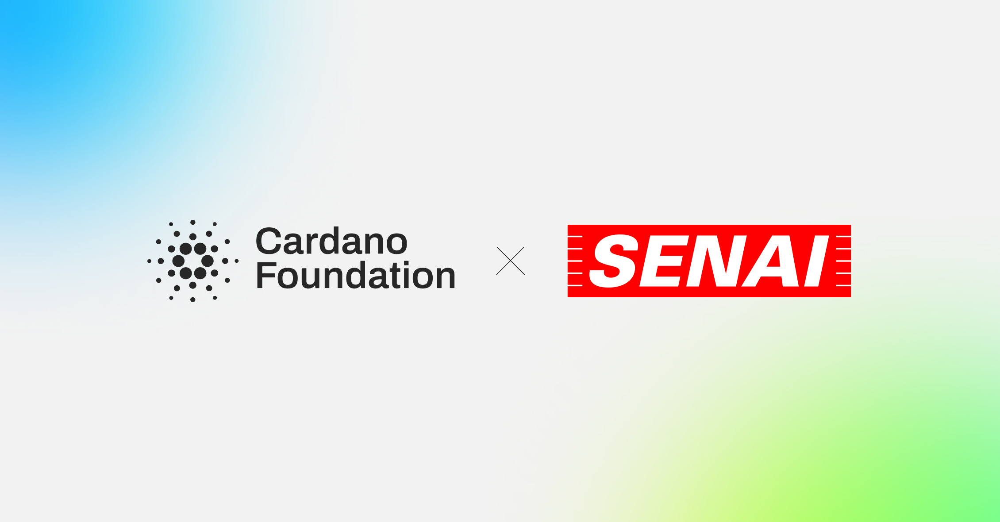

The Cardano Foundation has partnered with SENAI São Paulo to drive blockchain adoption across Brazilian industry. This collaboration introduces specialized training, educator certification programs, and executive education. It also launches practical, real-world industrial pilots, including Digital Product Passports, after an initial technical immersion successfully onboarded 130 research and education specialists.

 [**Read more**](https://cardanofoundation.org/blog/senai-sao-paolo-partnership) 

 

