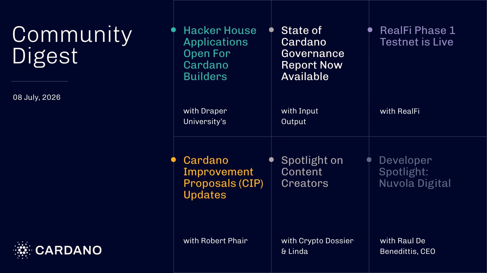

Applications are open for Draper University's Genesis Hacker House, a four week Silicon Valley residency for early stage teams building on Cardano, while Arouet Holdings is seeking candidates for its voluntary Community Director board role. The State of Cardano Governance 2026 report examines DRep participation, voting power concentration, and SPO engagement, with six recommendations to strengthen governance. RealFi launched its Phase 1 testnet, opening swap, stake, and unstake actions for its stablecoin based credit protocol, and several Cardano Improvement Proposals advanced through active review, including Proof of Existence metadata and DRep voting power concentration.

 [**Read more**](https://forum.cardano.org/t/digest-july-8-2026-genesis-hacker-house-applications-open-for-cardano-builders-state-of-cardano-governance-report-now-available-realfi-phase-1-testnet-is-live-cardano-improvement-proposals-cip-updates-spotlight-on-crypto-dossier-linda/155577/2) 

 
