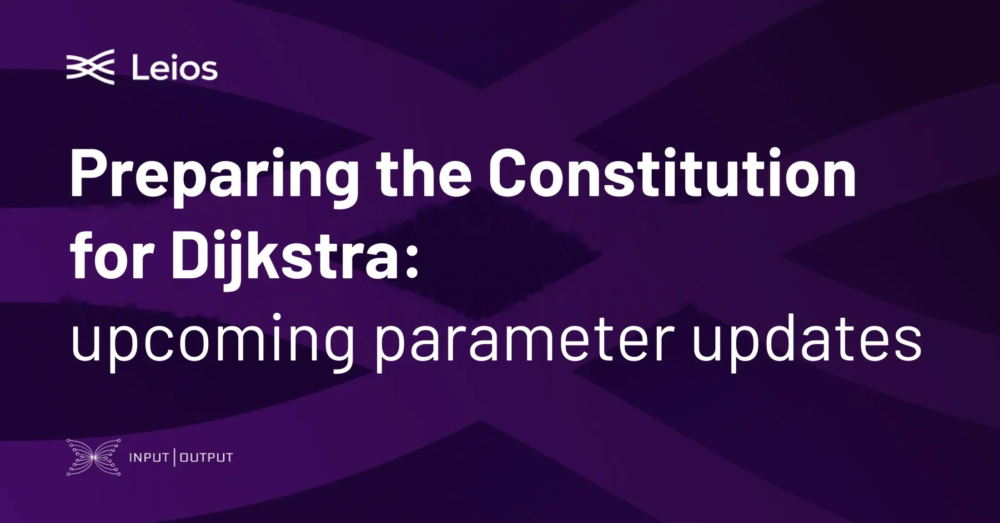

Input Output outlined a small, purely technical Constitution update ahead of the Dijkstra era, adding the new protocol parameters introduced by the hard fork to the Guardrails so they remain governable from day one. The proposal is strictly limited to the new parameters and their Guardrail ranges, with no changes to tenets, roles, or thresholds. DReps would ratify the change and the Constitutional Committee confirm its constitutionality, with submission targeted before epoch 655.

[**Read more**](https://www.iog.io/news/preparing-the-constitution-for-dijkstra)

