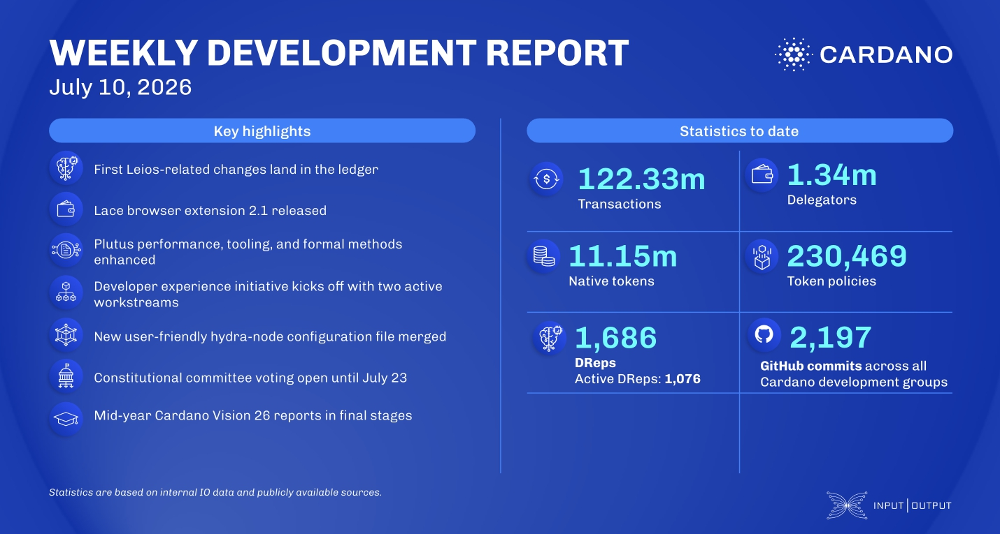

The performance and tracing team removed the legacy iohk-monitoring tracing backend (roughly 11,000 lines) and RTView from cardano-tracer, while the ledger team extended StAnnTx memoization to Alonzo and merged the first Leios-related changes. In wallets, Lace released browser extension 2.1, headlined by a wallet security check feature. Under Voltaire, DRep voting is underway in the Constitutional Committee election ahead of the July 23 deadline, and the Research team advanced its Cardano Vision 2026 workstreams with the first zero-knowledge technical workshop.

 [**Read more**](https://www.essentialcardano.io/development-update/weekly-development-report-as-of-2026-07-10) 

 
